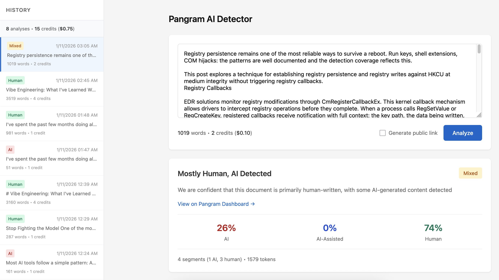

# Pangram Web UI

Simple web UI for the [Pangram](https://www.pangram.com/) AI detection API.



## Setup

1. Set your API key in `.env`:
   ```
   PANGRAM_API_KEY=your-api-key-here
   ```

2. Run the app:
   ```bash
   uv run main.py
   ```

3. Open http://localhost:5000

## Features

- Paste text and analyze for AI-generated content
- Word count and credit/cost calculation (1 credit = 1000 words = $0.05, minimum 1 credit)
- Displays AI/AI-Assisted/Human percentages
- Segment counts and token length
- Highlighted text view showing AI-detected sections with tooltips
- Optional public dashboard link generation
- **History sidebar** - all analyses saved to SQLite database
- **Usage stats** - track total analyses, credits, and cost
- Click any history item to reload without another API call

## CLI Tool

Query the database from the command line:

```bash
# Usage statistics
uv run python cli.py stats

# List recent analyses
uv run python cli.py list
uv run python cli.py list -n 50

# Show full analysis details
uv run python cli.py show <id>
uv run python cli.py show <id> --json  # include raw API response

# Search by text content
uv run python cli.py search "query"

# Export all to JSON
uv run python cli.py export
uv run python cli.py export -o backup.json

# Delete an analysis
uv run python cli.py delete <id>
uv run python cli.py delete <id> -f  # skip confirmation
```

## Database

All request/response pairs are stored in `pangram_history.db` (SQLite). Credits are calculated from word count, not stored directly.

## Pricing

The Pangram API charges per query:
- Up to 1,000 words: 1 credit ($0.05)
- Over 1,000 words: 1 credit per 1,000 words (rounded up)

Note: The API doesn't expose usage/billing endpoints, so cost tracking is calculated locally.
